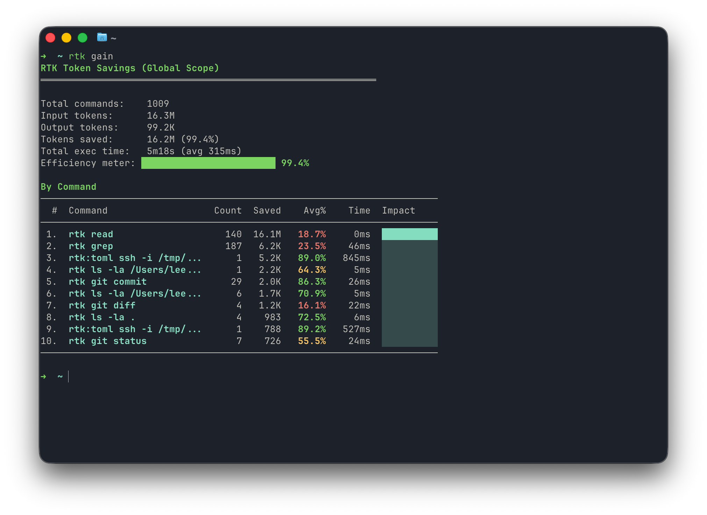

[rtk](https://github.com/rtk-ai/rtk) 会对你的命令输出进行压缩和过滤，能大幅度减少无意义的 token 消耗。

比如 `git status` 会输出紧凑的 stat 格式，`git log` 只留 hash、作者和标题，`pnpm test` 只留失败用例。

## 安装

```bash
brew install rtk
```

## 快速开始

```bash
# 1. Install for your AI tool
rtk init -g # Claude Code / Copilot (default)
rtk init -g --gemini # Gemini CLI
rtk init -g --codex # Codex (OpenAI)
rtk init -g --agent cursor # Cursor
rtk init -g --agent windsurf # Windsurf
rtk init --agent cline # Cline / Roo Code
rtk init --agent kilocode # Kilo Code
rtk init --agent antigravity # Google Antigravity
rtk init --agent kimi # Kimi AI
rtk init -g --agent pi # Pi
rtk init --agent omp # Oh My Pi (OMP)
rtk init --agent hermes # Hermes
rtk init -g --agent droid # Factory Droid

# 2. Restart your AI tool, then test
git status # Automatically rewritten to rtk git status
```

## 看省了多少

运行 `rtk gain` 查看统计数据。



[//]: # "跑到现在的数据大致是这样：987 条命令，原始输出约 16.3M，rtk 实际吐出来 97.5K，省下 16.2M，占 99.4%，总耗时 5m18s（平均 322ms）。榜上第一是 `rtk read`，单靠读文件就压掉了 16.1M。"

rtk 省掉的是「bash 输出」这一部分。而 bash 输出只是输入 token 的一部分，输入 token 又只是账单的一部分（还有系统提示、对话历史、输出 token）。所以 99.4% 说的是它经手的那部分被压掉了多少，不等于花费也少了 99%。
